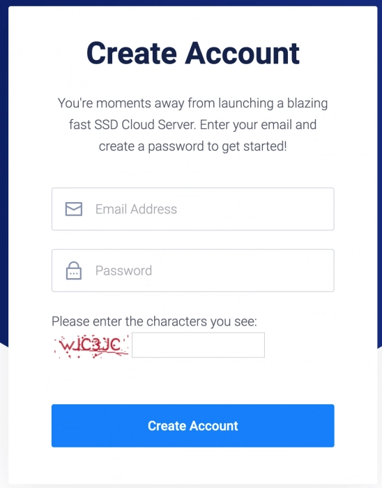
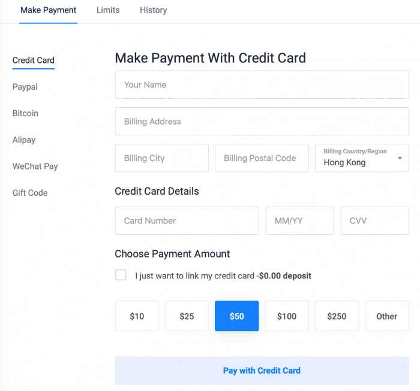
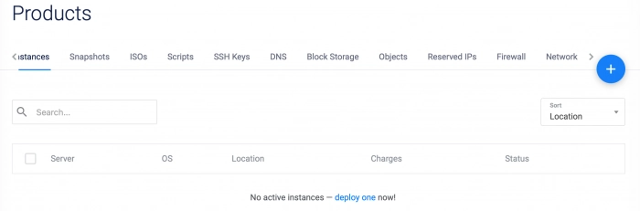
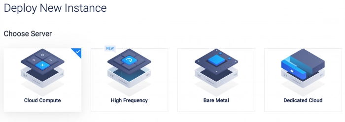
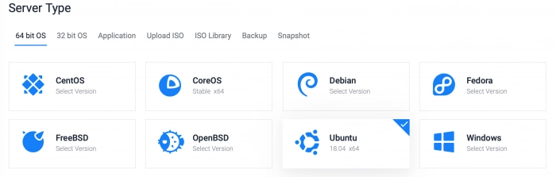
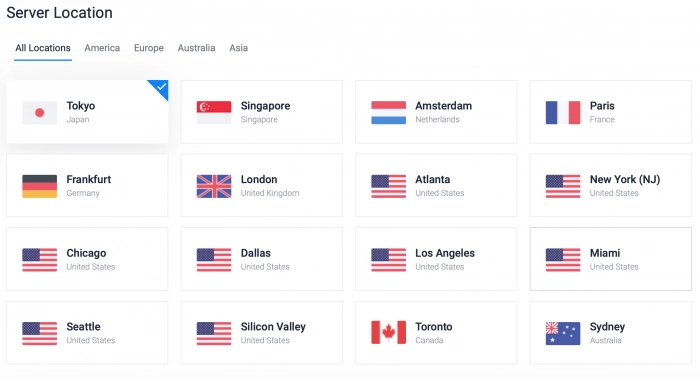
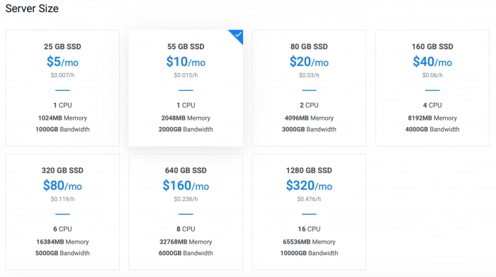
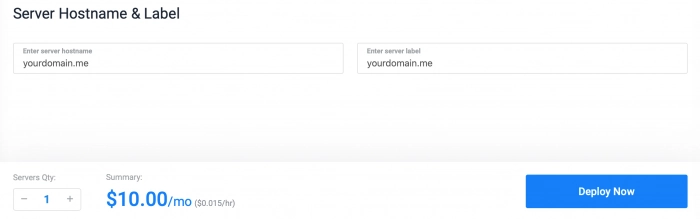
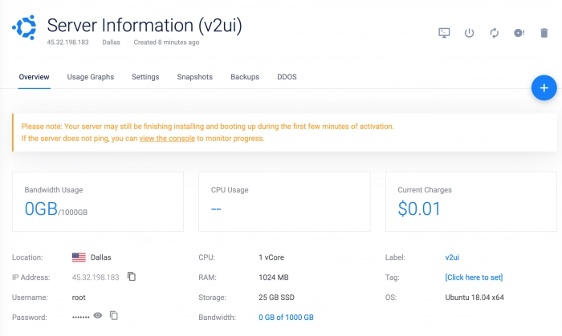
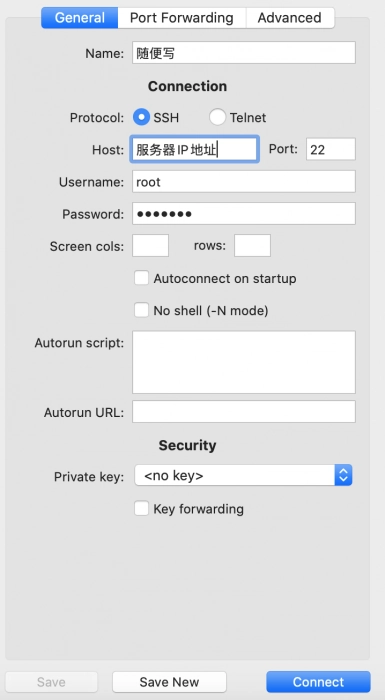

# Vultr新手注册指南：100美元优惠如何领取？

对于需要海外云服务器的用户来说，选择一个靠谱的VPS服务商是第一步。Vultr作为老牌云服务商，在全球部署了多个数据中心，支持按小时计费、支付宝和微信支付，对中国用户相当友好。新用户注册还能获得100美元的体验额度，足够测试各种应用场景。本文会带你走完整个注册流程，避开一些常见的坑。

---

## 准备工作：你需要什么

注册之前，建议准备好这些东西：
- 一个常用的邮箱（用来接收验证邮件）
- 信用卡或PayPal账号（用于身份验证）
- 10美元左右的预充值预算（降低被风控的概率）

现在Vultr对中国区用户的审核比以前严格了。原因很简单——太多人薅羊毛然后跑路，导致平台加强了真实性验证。所以即使你暂时不打算用，也建议先充个最低额度证明你是真实用户。

## 注册流程：一步步来

👉 [访问Vultr官网开始注册](https://www.vultr.com/?ref=9738262-9J)，整个过程不复杂，但有几个细节需要注意。

填写邮箱、设置密码、输入验证码，点击Create Account。系统会立即发送确认邮件到你的邮箱，点击邮件里的链接激活账号。

接下来是关键步骤——绑定支付方式。你可以选择信用卡或PayPal。这一步不会强制扣款，但强烈建议你充值至少10美元。原因前面说了：证明你是真实用户，而不是来批量注册薅羊毛的。

**关于优惠码**：文章提到的优惠码可能已过期。Vultr的促销活动经常变化，通过推广链接注册通常会自动获得当前的新用户优惠。

## 创建你的第一台服务器

注册完成后，进入控制面板。界面改版后比之前清爽多了，点击"Deploy"按钮开始创建服务器。

### 选择服务器类型

Vultr提供四种服务器类型，对于大多数人来说，**Cloud Compute**（云计算VPS）就够用了。价格最便宜，性能也不差。

### 选择操作系统

常见的选择是Ubuntu 18.04 LTS（长期支持版）或CentOS 7。如果你习惯用Windows，Vultr也支持Windows Server，不过价格会贵一些。

### 选择机房位置

这是影响速度的关键因素。对中国大陆用户来说：
- **日本东京**：理论上延迟最低，但中国用户扎堆，特殊时期可能被"照顾"
- **美国西海岸**（洛杉矶、硅谷）：速度也不错，相对稳定
- **美国中部**（芝加哥、达拉斯）：中国用户少，IP质量可能更好

我个人倾向美国中部机房。虽然延迟稍高几十毫秒，但IP被墙的概率更低，长期使用更省心。

### 选择配置套餐

看你的用途：
- **5美元/月**（1核1G内存，25G SSD）：个人使用足够，搭建轻量级应用没问题
- **10美元/月**（1核2G内存，55G SSD）：多人使用或建站推荐这个起步
- **20美元/月**（2核4G内存，80G SSD）：运行较重的应用或高流量网站

所有套餐都是KVM架构+SSD硬盘，1Gbps带宽，按小时计费。用不着随时可以删除，不会浪费钱。

### 其他设置

**开启IPv6**：建议开启，未来可能用得上。

**服务器名称**：随便填，方便你自己识别就行，比如"my-first-server"。

点击"Deploy Now"，系统开始部署。你会收到一封开通成功的邮件。

**重要提示**：等10分钟再操作。服务器需要时间完成系统初始化，太早连接可能会出问题。

## 获取服务器信息

部署完成后，点击服务器名称进入详情页，这里有你需要的所有信息：
- 服务器IP地址
- 管理员用户名（通常是root）
- 管理员密码
- 控制台按钮（直接在浏览器里操作服务器）

## 连接服务器

Windows用户可以用PuTTY或Xshell，Mac用户可以直接用终端或者vSSH这类图形化工具。

输入服务器IP、用户名和密码，连接成功后你就可以开始折腾了。

### 关于IP被墙的问题

如果你选了日本机房，有小概率会分到已经被墙的IP。怎么判断？访问 http://ping.chinaz.com 输入你的IP测试。如果国内节点全部超时，那就是中奖了。

**解决办法**：立即删除这台服务器（按小时计费，删了不吃亏），重新部署一台。多试几次总能拿到好IP。

## 全球机房测速地址

想知道哪个机房最适合你？直接下载测速文件测试实际速度：

- 东京：https://hnd-jp-ping.vultr.com/vultr.com.1000MB.bin
- 洛杉矶：https://lax-ca-us-ping.vultr.com/vultr.com.1000MB.bin
- 西雅图：https://wa-us-ping.vultr.com/vultr.com.1000MB.bin
- 硅谷：https://sjo-ca-us-ping.vultr.com/vultr.com.1000MB.bin
- 法兰克福：https://fra-de-ping.vultr.com/vultr.com.1000MB.bin
- 新加坡：https://sgp-ping.vultr.com/vultr.com.1000MB.bin

用下载工具或者浏览器直接下载，看速度就知道哪个机房更快。

---

## 总结

Vultr的注册流程确实比几年前严格了，但只要你是真实用户，按部就班走下来不会有问题。记住几个要点：
- 充值至少10美元证明真实性
- 等10分钟再连接新服务器
- 日本机房可能中奖被墙IP，多试几次

👉 [现在注册Vultr开始体验](https://www.vultr.com/?ref=9738262-9J)，对于需要稳定海外云服务器的用户来说，按小时计费的灵活性和全球16个机房的覆盖范围，让Vultr成为一个值得考虑的选择。服务器搭好之后，你可以用来建站、搭建各种应用，或者测试不同的网络环境。
